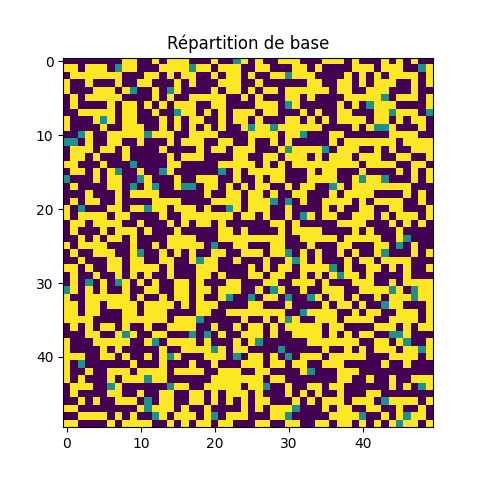
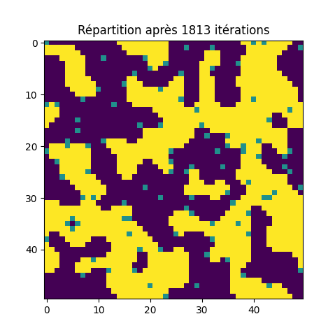

## Study of [Schelling's model of segregation](https://en.wikipedia.org/wiki/Schelling%27s_model_of_segregation) and the time it takes to reach equilibrium for a given number of agents.

By [Nicolas Gouwy](https://github.com/Iconejey/schelling-model).

-   Introduction
-   Model
-   Results
-   Conclusion

## Introduction

Sheil's model of segregation is a model of social interaction in which two distinct groups of people move from a location to another if their individual preferences are not satisfied. Satisfaction is measured by the number of people in each group who share a common attribute.

After a certain number of moves, the population gets more and more segregated until it reaches **equilibrium**. In this study, we will explore the time it takes to reach equilibrium for a given number of agents and satisfaction threshold.

## Model

The model consists of a grid of cells that can be separated into three groups:

-   The **yellow** agents
-   The **purple** agents
-   The **empty** spaces

Here is an example of a grid with three groups. On the left we have an initial configuration of the three groups and on the right we have this same configuration after reaching **equilibrium**.

